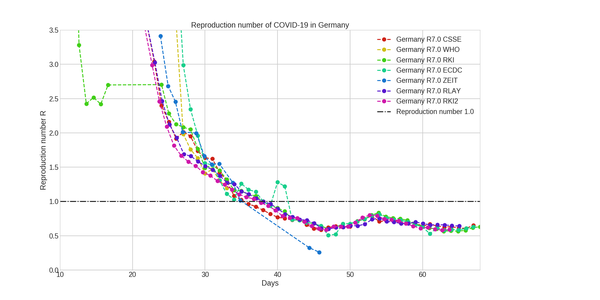
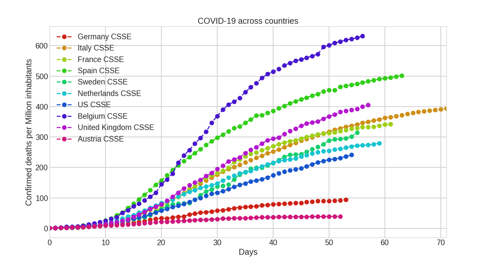

# Python functions for analyzing COVID-19 #

Some Python functions for analyzing COVID-19.

Structure
- IPython scripts in the main directory
- `/data/` for downloaded csv files and git repositories
- `/figs/` for figures
- `/site-packages/` for Python functions
  - `/covidfuncs/`: Functions for dataframes
  - `/covidinput/`: Functions for data import

## Prerequisites

### Python
- Python3 (tested: 3.7.5)
- IPython7 (tested: 7.11.1) for running the `.ipy` scripts
- add `/path/to/covid19/site-packages` to your `PYTHONPATH`
- heavily dependent on `pandas`

### Data
These are the used data repositories:

- clone `https://github.com/CSSEGISandData/COVID-19.git` from Github
  and into `/path/to/covid19/data`

- clone `https://github.com/covid19-eu-zh/covid19-eu-data.git` from Github
  and into `/path/to/covid19/data`

- clone `https://github.com/jgehrcke/covid-19-germany-gae.git` from Github
  and into `/path/to/covid19/data`

This csv file is used for German districts:

- csv data for German Landkreise from
  `https://npgeo-corona-npgeo-de.hub.arcgis.com/datasets/917fc37a709542548cc3be077a786c17_0`
  and download as spreadsheet `RKI_Corona_Landkreise.csv` into
  `/path/to/covid19/data`

More sources/inspirations for SIR model and plotting:

- SIR model in Python from
  `https://scipython.com/book/chapter-8-scipy/additional-examples/the-sir-epidemic-model/`

- Plot function idea from `https://github.com/twiecki/covid19`

## Plots for Germany

## Plots for multiple countries

