# Python functions for analyzing COVID-19 #

Some Python functions for analyzing COVID-19.

## Structure

- IPython scripts in the main directory
- `/data/` for downloaded csv files and git repositories
- `/figs/` for figures
- `/site-packages/` for Python functions
  - `/covidfuncs/`: Functions for dataframes
  - `/covidinput/`: Functions for data import

## Prerequisites

### Python
- Python3 (currently used: 3.6.9)
- IPython7 (currently used: 7.8.0) for running the `.ipy` scripts
- add `/path/to/covid19/site-packages` to your `PYTHONPATH`
- heavily dependent on `pandas`

### Data
These are the used data repositories:

- clone `https://github.com/CSSEGISandData/COVID-19.git` from Github
  and into `/path/to/covid19/data`

- clone `https://github.com/covid19-eu-zh/covid19-eu-data.git` from Github
  and into `/path/to/covid19/data`

- clone `https://github.com/jgehrcke/covid-19-germany-gae.git` from Github
  and into `/path/to/covid19/data`

This csv file is used for German districts:

- csv data for German Landkreise from
  `https://npgeo-corona-npgeo-de.hub.arcgis.com/datasets/917fc37a709542548cc3be077a786c17_0`
  and download as spreadsheet `RKI_Corona_Landkreise.csv` into
  `/path/to/covid19/data`

- csv data from RKI `https://npgeo-corona-npgeo-de.hub.arcgis.com/datasets/dd4580c810204019a7b8eb3e0b329dd6_0?selectedAttribute=AnzahlTodesfall` as spreadsheet `RKI_COVID19.csv` in `/path/to/covid19/data`

R-Script for nowcast

- R-script `nowcast_dem.R` from
  `https://onlinelibrary.wiley.com/action/downloadSupplement?doi=10.1111%2Fbiom.12194&file=biom12194-sm-0001-SuppDataCode.zip`
  put in `/path/to/covid19/` and adapted to run with
  `coviddata_rki.csv`

More sources/inspirations for SIR model and plotting:

- SIR model in Python from
  `https://scipython.com/book/chapter-8-scipy/additional-examples/the-sir-epidemic-model/`

- Plot function idea from `https://github.com/twiecki/covid19`

- Idea for casecase plot from Minute Physics Youtube Channel

## Plots for Germany (reliable)

The German data is most reliable, since it is compared from different
sources, including the official data from Robert-Koch-Institut (both
by date of local reporting and date of reporting to the RKI). For the
Landkreise the data becomes less reliable because the numbers are
small.

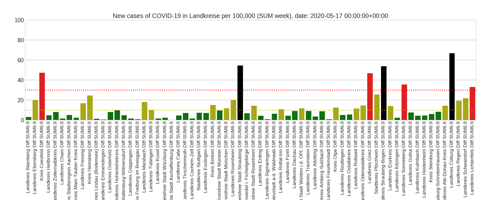

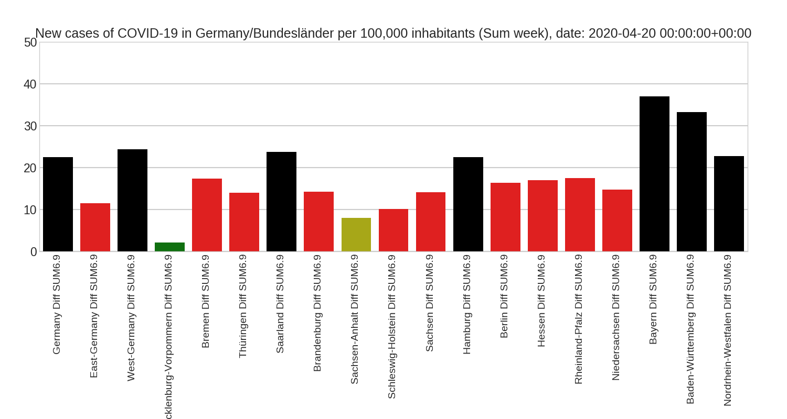
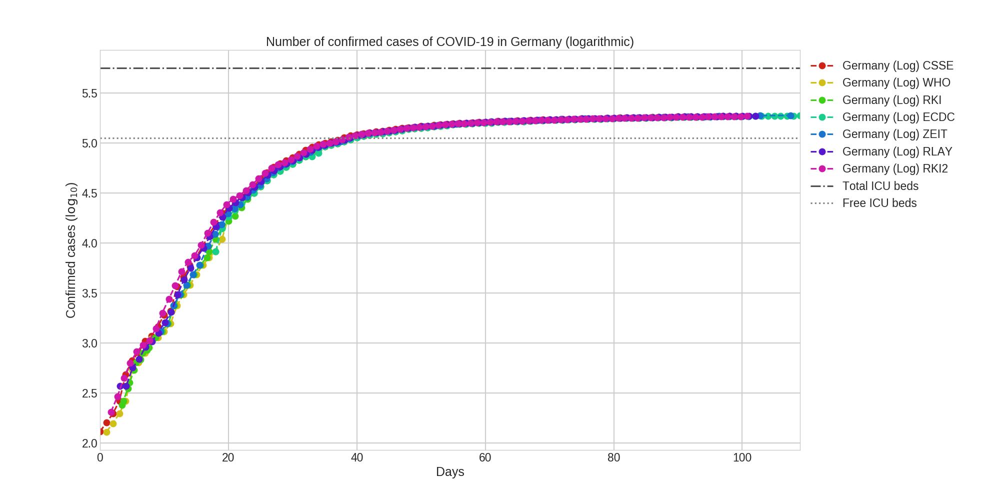
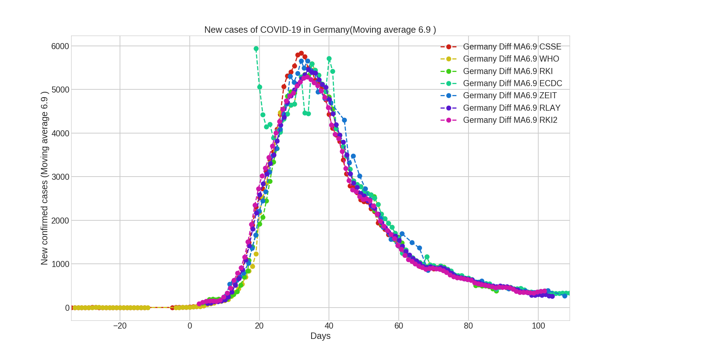
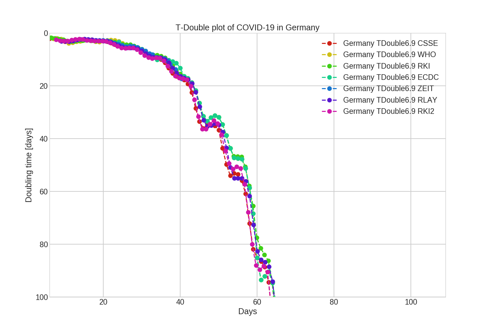

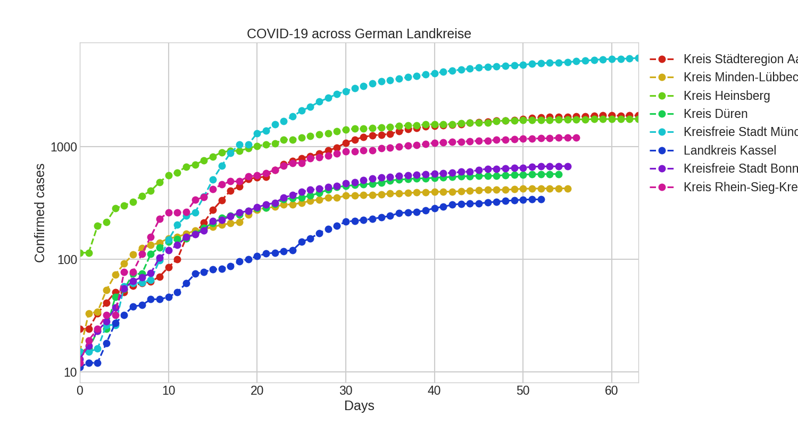
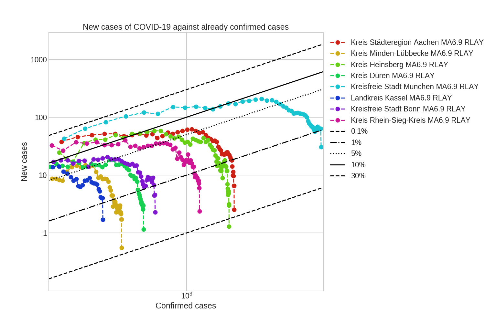

## Plots for multiple countries (possibly unreliable, hardly comparable)

The country-data (from JHU-CSSE) are hardly comparable, as the number
of confirmed cases in a country depends on a number of influences. Two
examples: (1) the number of tests per week and (2) the modalities of
reporting.

For the number of deaths, one country may only report fatalities with
a positive test, while other countries may additionally report
fatalities that showed symptoms, but were not tested.

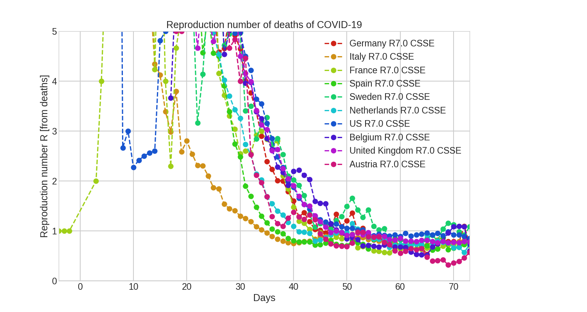
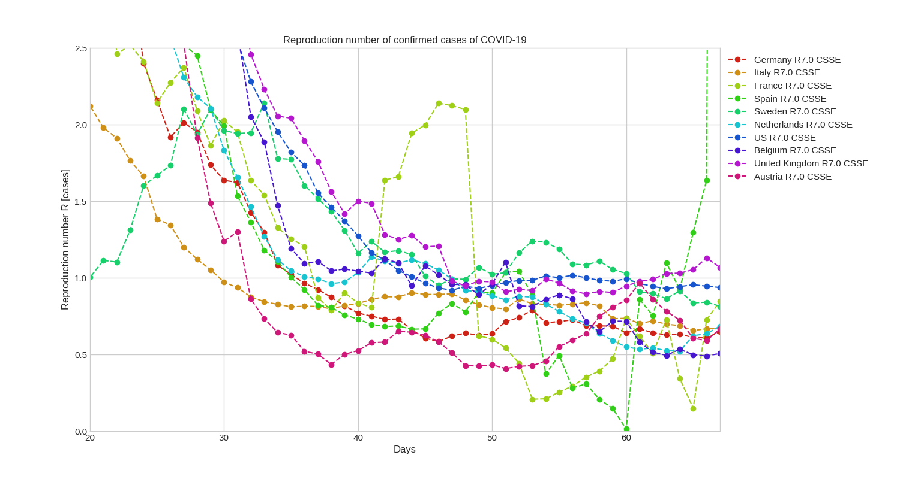
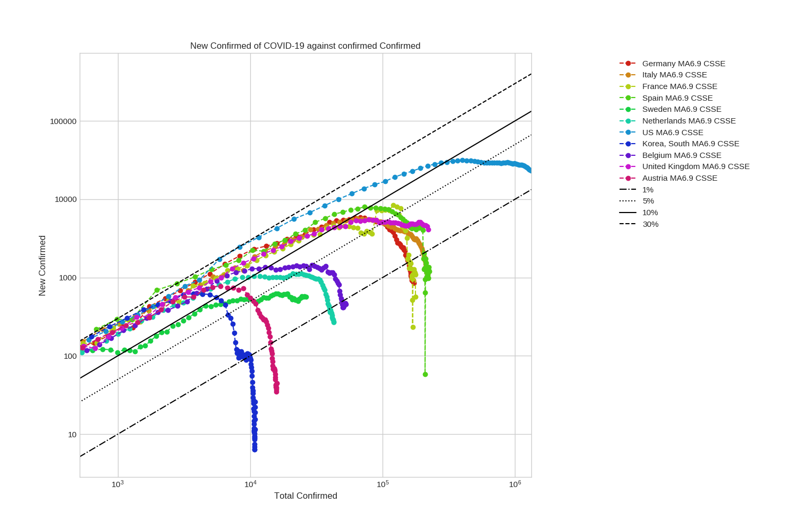
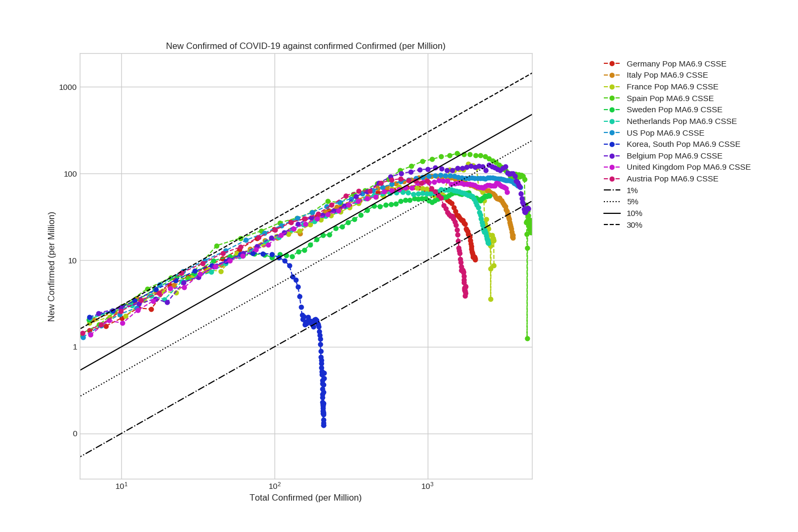

## Currently infected (almost completely unreliable)

This data is even more uncertain than the numbers of confirmed cases
and deaths across countries. The number of recovered cases is only
crudely estimated, for example by taking the new cases from two weeks
ago.

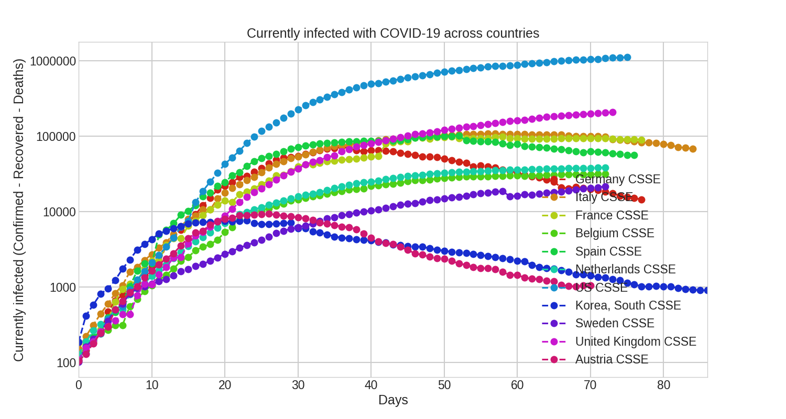
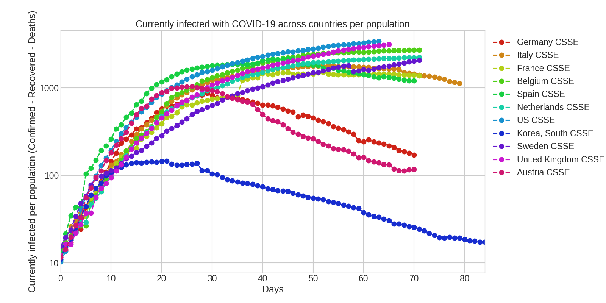
